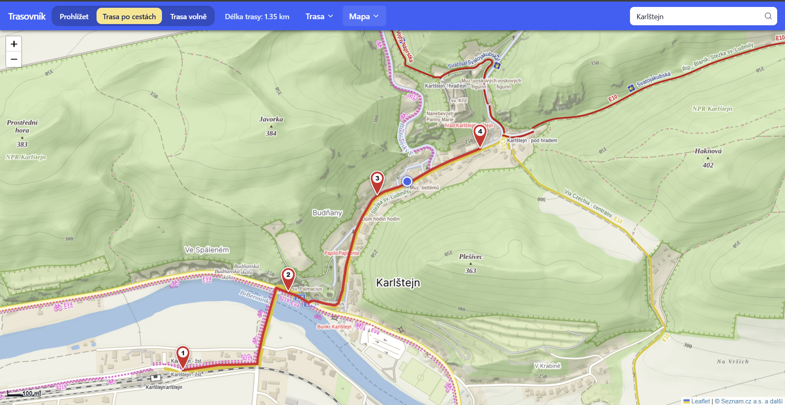

# Trasovník (RouteMaker)

Trasovník (RouteMaker) is trying to help with creating, measuring and downloading own maps and routes using [Leaflet](https://leafletjs.com/) maps.

The application was built to serve the needs of the [Cestou Vysočiny](https://www.stoky.cz/cestou-vysociny/a-1388) trailer initiative and tourism coordinators in the Vysočina region.

You can try the application here: https://trasovnik.mareska.xyz/



## Tech Stack

- [React](https://react.dev/) + [TypeScript](https://www.typescriptlang.org/)
- [Leaflet](https://leafletjs.com/) + [react-leaflet](https://react-leaflet.js.org/)
- [Tailwind CSS](https://tailwindcss.com/) + [shadcn/ui](https://ui.shadcn.com/)
- [Vite](https://vite.dev/)

## Development

```bash
npm install
npm run dev
```

## Build

```bash
npm run build
```
